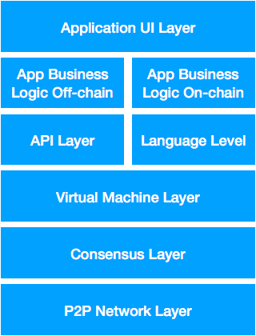

Recent blossom of different blockchain projects creates a need for a proper blockchain architecture abstraction — some sort of a standard which can help developers and industry experts to easily understand how are different parts of blockchain technosphere interrelate.

# 1. P2P Network Layer

P2P network layer is responsible for inter-node communications: discovery and data transfer 
(usually transactions and block propagation). Typical sample of this layer is DEVP2P library 
used by the Ethereum project. Many blockchains, including Bitcoin and its forks (Litecoin, Dash) 
do not designate some specific name for this layer (however they still include code and abstractions 
to implement such functionality).

# 2. Consensus Layer

This is one of the most crucial layers present in all stand-alone blockchains. Layer includes code 
required to generate the order of blocks creation and validate blocks created by other nodes in the network. 
There are so many different consensus protocols that it worth to mention their generic categories rather 
specific realizations.

First of all it’s a PoW (proof of work) consensus used by Bitcoin and, with modifications to hashing algorithm, by its clones.

Next, PoS (proof of stake), present in NXT and Graphene-related blockchains (Bitshares, Steem, 
forthcoming EOS) in form of dPoS. Other PoS realizations are mainly drafts, including Casper 
(proposed Ethereum PoS) and Ouroboros (formally-verified PoS consensus by IOHK used in Cardano).

Other approaches to consensus layer include such variants as proof of importance (NEM, modification of PoS), 
proof of activity, proof of burn and more.

Permissioned blockchains or testnets may rely on other variants, including proof of authority (like 
Ethereum Kovan testnet), proof of elapsed time (Hyperledger Sawtooth that can run only on specific Intel 
hardware) etc. This category stands separately from the previous three, since these consensuses are suited 
for a trusted/managed environments environment.

# 3. Virtual Machine Layer

Virtual machine is a “transactional engine”, responsible for changes in a blockchain’s world state. 
This level is present in all blockchains, but frequently is not being clearly distinguished from the consensus level.
However, we emphasise the importance of such distinction because, while the network layer is responsible 
for a blockchain’s world state propagation and eventual consistency, the consensus layer is responsible for 
consistency and world state validation, the virtual machine layer is required for world state changes themselves. 
Without virtual machine the blockchain would not have transactions to fill the blocks :)

In general, blockchain-based virtual machines can be divided into two main categories: Turing-complete and 
Turing-incomplete. And, two main virtual machines, used by upper abstraction levels they already present on the 
market are Bitcoin transaction engine executing Bitcoin Script bytecodes (Turing-incomplete VM) and 
Ethereum Virtual Machine (Turing-complete EVM). But they are not the only ones. While previous years were 
filled with new consensuses, this year (2017) is specifically notable for new virtual machine announcements. 
These are: WebAssembly (WASM) that is being integrated into the Parity client for Ethereum, RChain virtual 
machine with concurrency, the TrueBit virtual machine presented these days on DEVCON3, IELE (VM by Cardano), 
Common language runtime-based VM by NEO… (I’m quite sure, there are a lot of others).

Such virtual machines can be frequently used outside of the original blockchain on top of other consensuses 
and network layers. For instance, Rootstock applies EVM to the Bitcoin blockchain and WASM will probably be 
shared by a number of blockchains as well.

In general, I suppose that next year we will see further shift from new consensuses to new virtual machine 
development, until there will be scalable and market-proven solutions for all main blockchain app types.

# 4a. API Layer

The forth blockchain abstraction layer consists of two “branches”: API, used by on-chain applications in 
runtime, and programming languages, used in development time and compiled for runtime into a binary code 
that can be put into blockchain and understood by the virtual machines.

API branch of the forth abstraction level is presented by an interface of blockchain nodes that can be accessed 
from off-chain applications. The most famous example is Ethereum JSON RPC protocol and Web3.js based on it. 
We can also probably count OMNI Layer and Counterparty as members of Bitcoin API family.

# 4b. VM Programming Languages

This is another “bestseller” in 2017, when we observe proliferation of new languages, mostly very immature 
(with some prominent samples of much more well-designed attempts).

Programming languages can be quite well distinguished into a number of categories — according to the underlying 
VM that they are designed for.

- EVM languages — the most popular category these days. They include original LLL, Serpent (outdated due 
to some compiler bugs), Solidity (the most popular smart contract language as for today), pre-released Viper 
(Serpent offspring) and some highly-experimental attempts like Bamboo (state-machine functional-type language) 
and Babbage (visual programming language) both being presented yesterday at DEVCON3.

- WebAssembly-compiled languages which, due to LLVM-to-WASM, include the whole rich family of LLVM languages, 
including C/C++, Swift, Python, Ruby, Rust and many, many others. Unfortunately, modern blockchain VM do not 
support the whole set of LLVM instructions, not mentioning language standard libraries, without which language 
usage could become quite painful. Thus, these are quite early experiments not ready for real-world projects yet.

- CLR languages. CLR is “Common Language Runtime” that includes all .NET-based languages from Microsoft 
(C#, F#, VisualBasic.NET etc). Currently they are supported by the Neo blockchain, and, probably, we will see 
more support in the nearest future.

- Functional smart contract languages, derived from variants of original functional languages like Haskell etc. 
These languages put big emphasis on formal verification methods, proving that smart contracts will function 
as expected at their design. Briefly, this approach can be called “it will work if it was compiled” approach 
(it is worth to mention that in this case it is usually much harder to write a code that will compile :). 
Among this category we can mention the announced Plutos language for Cardano blockchain and Rholang used by RChain. 
At least one of the young EVM languages can be put in this category as well.

- Non-Turing complete languages for specific blockchains, like ones used by OMNI Layer and Counterparty.

- Other. This is the “default case” and include the rest of smart contract (and “smart contract”) languages which 
do not fall into any of the above categories :)

# 5. Application Business Logic Layer (On-chain and Off-chain)

Starting from this layer the code is usually written by third-party developers and not by core blockchain teams. 
In fact, these are application-specific projects that utilize the underlying blockchain in order to deliver some 
vertical solutions. The biggest example is the growing ecosystem of Ethereum-based dApps and specific smart contracts. 
In fact, any smart contract is a member of this abstraction level. Additionally to Turing-complete smart contracts 
for Ethereum/Rootstock this level can be populated by Turing-incomplete apps written on top of Bitcoin OMNI Layer and Counterparty.

We have mentioned that there are two “branches” for the app business logic: on-chain and off-chain. The on-chain 
part is the actual smart contract code that is written with some level 4 language and (after compilation) becomes 
part of the blockchain state (level 2) and can be executed by an appropriate virtual machine (level 3). Off-chain 
part is the code required to link the smart contract business logic to the outside world — or to create 
inter-blockchain business logic. We can divide this code into three main categories: (1) oracles, (2) client- and 
server-side code for dApps (javascript, python etc) and (3) domain-specific off-chain systems including lite protocols 
and scalability solutions (Lightning Network, Raiden).

# 6. Application UI Layer

The final layer is the actual UI of the dApp presented to user. Usually it is being created with Javascript/HTML 
calling underlying level-5 app business logic, but it can also be native desktop and apps, like wallets.

# Final remarks

Of course, this incomplete list of existing blockchain implementations and related technologies should be seen as a 
primer rather than well-defined vision. A number of important technologies which have become a required part of modern 
dApp development are left without specific place in this architectural overview: IPFS and Swarm, Whisper, IPDB. 
We also did not cover DAG variants (IOTA, Byteball) and non-blockchain technological stacks related to P2P 
(like BitTorrent)… So we invite all interested parties for a further discussion (Reddit link) and joint work on 
some initial technological drafts for a common blockchain architecture.
